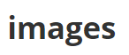

## Letterify
a simple web api to extract letters from images, build with tesseract, flask and redis, the backend is build with flask simple server. we use [tesseract](https://github.com/tesseract-ocr/tesseract) to extract letters from images, finally the result is saved to redis for further use.


### Usage:
##### Upload API

upload the following image to the server using request library



```python
import requests
url = 'http://localhost:5000/'
filepath = 'test.png'
# upload file using requests
with open(filepath, 'rb') as f:
    files = {'file': f}
    r = requests.post(url, files=files)
# get reponse
res = r.json()
```

  the result will be as follows:

```json
{
  "key": "1b0d36dc234a996fdb55b457d084fb23", # md5 of the file
  "letters": ["i", "m", "a", "g", "e", "s"], # extract letters
  "query_url": "http://localhost:5000/1b0d36dc234a996fdb55b457d084fb23" # for further query
}
```

##### Query API

you can query the result latter

```python
key = '1b0d36dc234a996fdb55b457d084fb23'
# query results
url = 'http://localhost:5000/' + key
res = requests.get(url)
print(res.json()) 
```

### Develop With Docker

We using docker as a development environment, 

#### Environment Setup

1. install the latest docker server and client.
2. install docker-compose for ease service management
3. build docker image, see Dockerfile for software requirements.
  `docker build . -t letterify`
4. `docker-compose up -d` to start web and redis service 


#### File Structure

1.  the request hander was in `app.py`,  include a post hander to save file, and get handler to return results
2.  the `utils.py` file includes some function to process images
3.  the redis db is declared in the docker-compose file, which can start when you run docker-compose start.

### Tests
the tests are in the test directory. you can run test with command
`python -m unittest discover`

### Deploy
1. Environment Variable
  * Set DEBUG to False in docker-compose.yml
2. Expose port 80


### TO DO
1. using celey to delay and distibute a image processing task.
2. using a mock database to run tests.